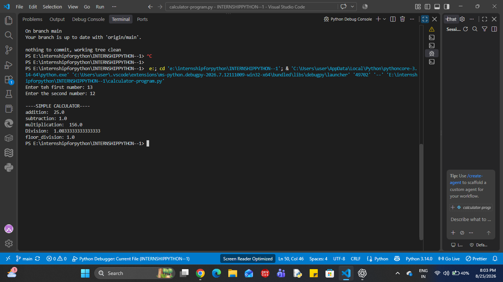
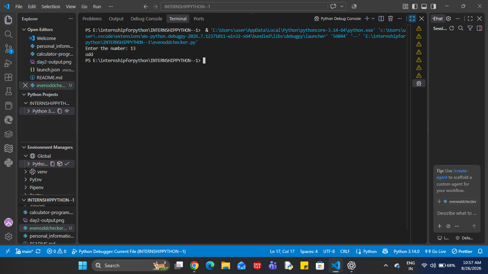
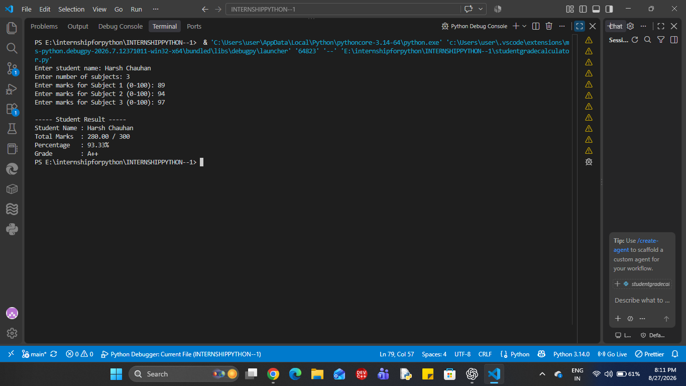

# INTERNSHIPPYTHON--1
this is a clean repository for mainly  python programme . This is a best source for internship and today is the day one
This project is a simple Python program taht accepts a user's basic personal information and displays it as a clean, formatted profile. 
This proiject was created as part of Level 1 - Day 1 of the Python PRogramming internship.

Objective
: python variable 
: f-strings
: data type
: type conversion

Technologies used; 
python
vs code
inputs : 
the inputs whuch we have given in program are
> name 
> age
> cgpa
> college
> city
> course
> grade

 numeric values are converted to appropriate data types using type casting.

 output:
 The program displays the entered information in a clean and formatted student profile.

 How to run 
 1) Make sure python is installed on your system.
 2) open the the project folder in vs code.
 3) open the terminal
 4) run the following command: 
    git add -personal_information.py
    git commit "then add some message"
    then git push origin main

5) enter the requested information when prompted.

output 
now the program generate teh output.

SAMPLE OUTPUT:
--student details--
Name: Harsh Chauhan
course:Btech
cgpa:8.09
city:Agra
college:Hindustan College of SCience and Technology
age:19
grade:A

Project structure: 
INTERNSHIPPYTHON-1
||
  | - persoanl_information.py
  | - README.md


  INTERVIEW QUESTIONS 
  1) WHAT IS A VARIABLE TO PYTHON?
  Basically it is an address of the memory given by the user.
  eg : age = 19
  hence , age is teh variable

  2) DIFFERENCE BETWEEN THE INPUT() AND prinT()?
  input() it is used to input the information from the user. 
  print() it is used to display the output to the user. 

  3) what is an f-strings?
  An f-string is a convienient way to put variables or expressions directly inside a string. 
  name = "Harsh"
  print(f"name: {name}")

  4)what is type conversion required for user input?
  Because input() returns the entered value as a string.
  for eg: 
  age = input("Enter teh age: ")
  in this example, 
  we see that the age give input in string data type.

  age = int(input("Enter teh age: "))
  in this example, 
  we see that the age is print in int data type.


  #day - 2 
  simple calculator program
  --project overview:
  This project is a simple Python calculator that accepts two numbers from the user and performs basic arithmetic operations.

  OBJECTIVE:

  to practice 
  ___ user input handling
  __ arithmetic operators
  __ Functions
  __ Basic program logic

  Features:

  ___ addition
  ___ subtraction
 ____ multiplication
 ___ division
 ___ floor(//)

 Technologies used:
 ___ VS code
 ___ Python

 How to run
 1) open the vs code 
 2) make a calculator file 
 3) tehn run the program 
 4) by git add, init, commit and then push 
 5) make your local repo to the github.

 Sample output:

 Enter teh first number: 12
Enter the second number: 2

----SIMPLE CALCULATOR----
addition:  14.0
subtraction: 10.0
multiplication:  24.0
Division:  6.0
floor_division: 6.0

INTERVIEW QUESTIONS 

1) - /performs regular division.
   - // performs floor division which give round off the value of whole division.
   - % performs modulo division which give remainder as an output.

2) The program checks for division or modulus by zero and displays an appropriate message instead of causing the program to crash.

----INTERNSHIP PROGRESS----
> day 1 - personal information program
> day 2 - simple calculator program

### 🧪 Day 2 Output




Day - 3 : BUILD AN EVEN OR ODD CHECKER

PROJECT OVERVIEW
this project is a simple python program to display the even number or odd number by given data through the user. 

Objective:
the objective of this project is to learn:
. conditional statements(if or else)
. THE modulo operator(%)
.integer input using input() and int()
. basic python program

Tehnologies used:
Python
Vs code

Program logic:
The program checks the remainder when the entered number is divided by 2:
. if number % 2 == 0 then even 
. else odd.

Python code:
a = int(input("Enter the number: "))
if a % 2 == 0:
    print("even")
    
else:
    print("odd")

    Test cases:
    input | output
    13        odd


 sample output:

 Enter the number: 13
 odd

 INTERVIEW QUESTIONS:

 1) HOW DO YOU CHECK WHETHER A NUMBER IS EVEN IN PYTHON?
 ANS - we check the number is even when number % 2 gives remainder is equal to zero.

 2)what is the purpose of % operator?
 ANS - It returns the remainder after division.

 3)What is the difference between if, elif, else?
 ANS - if checks a condition, elif checks another condition where previous condition is false. Else executes the final condition whereas all of the previous conditions is false.

 INTERNSHIP  PROGRESS
 > day 1 - personal information program
> day 2 - simple calculator program
> day 3 - even or odd checker program

### day 3 - output
## 📸 Sample Output



###DAY -4 INTERNSHIP 
# 🎓 Student Grade Calculator

## 📌 Project Overview

The Student Grade Calculator is a Python program that accepts a student's name and marks for multiple subjects.

It calculates:

- Total marks
- Percentage
- Final grade

The program also validates user input to prevent invalid marks.

---

## 🎯 Objective

This project was created as part of **Day 4 of the Veda Technology Python Programming Internship**.

The main objectives are to practice:

- Conditional statements
- Arithmetic operations
- Input validation
- `try-except` exception handling
- Loops
- User input
- Formatted output

---

## 🛠️ Technologies Used

- Python
- VS Code

---

## ⚙️ How the Program Works

1. The program asks for the student's name.
2. It asks for the number of subjects.
3. It accepts marks for each subject.
4. Marks are validated between `0` and `100`.
5. Invalid or non-numeric input is rejected.
6. The program calculates total marks.
7. The percentage is calculated.
8. A grade is assigned according to the predefined criteria.
9. The final student result is displayed.

---

## 📊 Grade Criteria

| Percentage | Grade |
|------------|-------|
| 90–100% | A++ |
| 80–89% | A |
| 70–79% | B+ |
| 60–69% | B |
| 50–59% | C+ |
| 40–49% | C |
| 30–39% | D |
| 20–29% | E |
| Below 20% | F |

---

## ✅ Input Validation

The program checks that:

- The number of subjects is greater than `0`.
- Marks are not negative.
- Marks do not exceed `100`.
- Numeric input is entered where required.

If invalid input is entered, the program displays an appropriate message and asks for valid input.

---

## 🧮 Calculation

### Total Marks

```text
Total Marks = Sum of marks obtained in all subjects

png
🎓 Interview Questions
1. How would you validate user input?

I would use conditional checks to verify that marks are within the allowed range. I can also use try-except to handle invalid data types.

2. How does Python evaluate multiple conditions?

Python evaluates conditions from top to bottom in an if-elif-else structure. Once a condition is true, its corresponding block is executed.

3. What happens if a user enters a value outside the expected range?

The program identifies the value as invalid and asks the user to enter a valid value within the allowed range.

🚀 Future Improvements
Add individual subject names.
Store student results in a file.
Add multiple student records.
Create a graphical user interface.
Generate a result report automatically.
👨‍💻 Internship

Veda Technology — Python Programming Internship

Day 4 Task: Student Grade Calculator

## 📸 Sample Output




