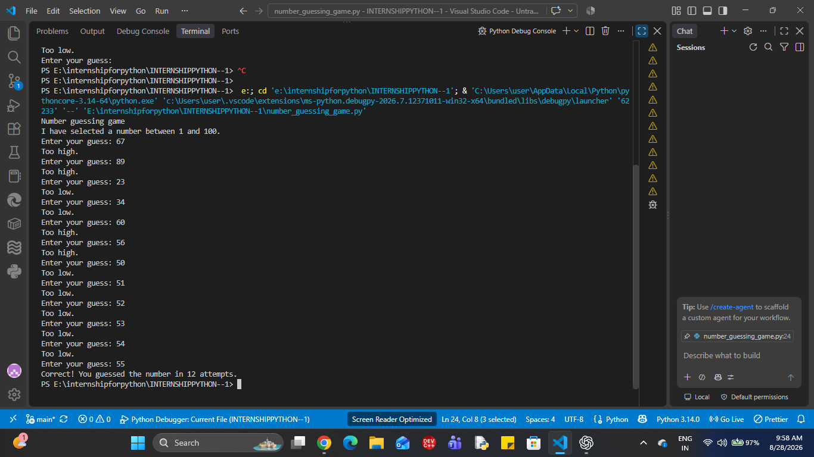
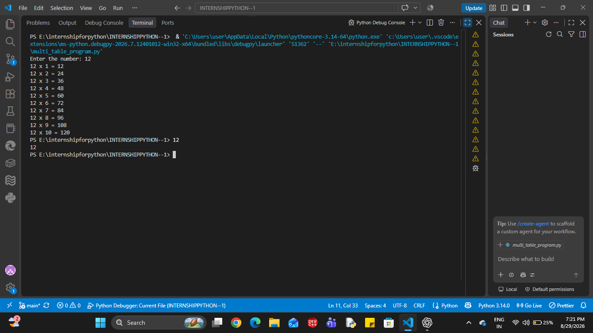
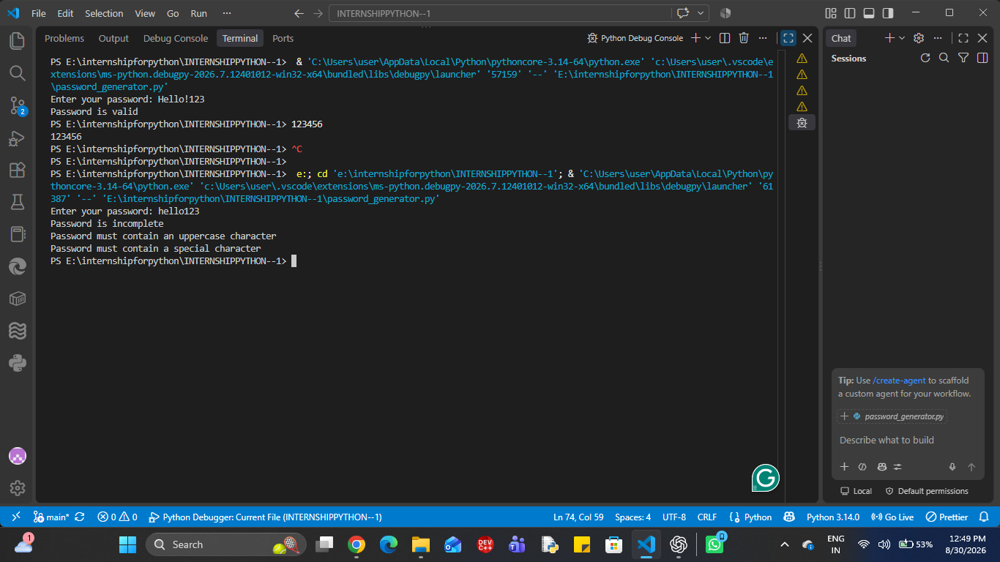

# INTERNSHIPPYTHON--1
this is a clean repository for mainly  python programme . This is a best source for internship and today is the day one
This project is a simple Python program taht accepts a user's basic personal information and displays it as a clean, formatted profile. 
This proiject was created as part of Level 1 - Day 1 of the Python PRogramming internship.

Objective
: python variable 
: f-strings
: data type
: type conversion

Technologies used; 
python
vs code
inputs : 
the inputs whuch we have given in program are
> name 
> age
> cgpa
> college
> city
> course
> grade

 numeric values are converted to appropriate data types using type casting.

 output:
 The program displays the entered information in a clean and formatted student profile.

 How to run 
 1) Make sure python is installed on your system.
 2) open the the project folder in vs code.
 3) open the terminal
 4) run the following command: 
    git add -personal_information.py
    git commit "then add some message"
    then git push origin main

5) enter the requested information when prompted.

output 
now the program generate teh output.

SAMPLE OUTPUT:
--student details--
Name: Harsh Chauhan
course:Btech
cgpa:8.09
city:Agra
college:Hindustan College of SCience and Technology
age:19
grade:A

Project structure: 
INTERNSHIPPYTHON-1
||
  | - persoanl_information.py
  | - README.md


  INTERVIEW QUESTIONS 
  1) WHAT IS A VARIABLE TO PYTHON?
  Basically it is an address of the memory given by the user.
  eg : age = 19
  hence , age is teh variable

  2) DIFFERENCE BETWEEN THE INPUT() AND prinT()?
  input() it is used to input the information from the user. 
  print() it is used to display the output to the user. 

  3) what is an f-strings?
  An f-string is a convienient way to put variables or expressions directly inside a string. 
  name = "Harsh"
  print(f"name: {name}")

  4)what is type conversion required for user input?
  Because input() returns the entered value as a string.
  for eg: 
  age = input("Enter teh age: ")
  in this example, 
  we see that the age give input in string data type.

  age = int(input("Enter teh age: "))
  in this example, 
  we see that the age is print in int data type.


  #day - 2 
  simple calculator program
  --project overview:
  This project is a simple Python calculator that accepts two numbers from the user and performs basic arithmetic operations.

  OBJECTIVE:

  to practice 
  ___ user input handling
  __ arithmetic operators
  __ Functions
  __ Basic program logic

  Features:

  ___ addition
  ___ subtraction
 ____ multiplication
 ___ division
 ___ floor(//)

 Technologies used:
 ___ VS code
 ___ Python

 How to run
 1) open the vs code 
 2) make a calculator file 
 3) tehn run the program 
 4) by git add, init, commit and then push 
 5) make your local repo to the github.

 Sample output:

 Enter teh first number: 12
Enter the second number: 2

----SIMPLE CALCULATOR----
addition:  14.0
subtraction: 10.0
multiplication:  24.0
Division:  6.0
floor_division: 6.0

INTERVIEW QUESTIONS 

1) - /performs regular division.
   - // performs floor division which give round off the value of whole division.
   - % performs modulo division which give remainder as an output.

2) The program checks for division or modulus by zero and displays an appropriate message instead of causing the program to crash.

----INTERNSHIP PROGRESS----
> day 1 - personal information program
> day 2 - simple calculator program

### 🧪 Day 2 Output


Day - 3 : BUILD AN EVEN OR ODD CHECKER

PROJECT OVERVIEW
this project is a simple python program to display the even number or odd number by given data through the user. 

Objective:
the objective of this project is to learn:
. conditional statements(if or else)
. THE modulo operator(%)
.integer input using input() and int()
. basic python program

Tehnologies used:
Python
Vs code

Program logic:
The program checks the remainder when the entered number is divided by 2:
. if number % 2 == 0 then even 
. else odd.

Python code:
a = int(input("Enter the number: "))
if a % 2 == 0:
    print("even")
    
else:
    print("odd")

    Test cases:
    input | output
    13        odd


 sample output:

 Enter the number: 13
 odd

 INTERVIEW QUESTIONS:

 1) HOW DO YOU CHECK WHETHER A NUMBER IS EVEN IN PYTHON?
 ANS - we check the number is even when number % 2 gives remainder is equal to zero.

 2)what is the purpose of % operator?
 ANS - It returns the remainder after division.

 3)What is the difference between if, elif, else?
 ANS - if checks a condition, elif checks another condition where previous condition is false. Else executes the final condition whereas all of the previous conditions is false.

 INTERNSHIP  PROGRESS
 > day 1 - personal information program
> day 2 - simple calculator program
> day 3 - even or odd checker program

### day 3 - output
## 📸 Sample Output


###DAY -4 INTERNSHIP 
# 🎓 Student Grade Calculator

## 📌 Project Overview

The Student Grade Calculator is a Python program that accepts a student's name and marks for multiple subjects.

It calculates:

- Total marks
- Percentage
- Final grade

The program also validates user input to prevent invalid marks.

---

## 🎯 Objective

This project was created as part of **Day 4 of the Veda Technology Python Programming Internship**.

The main objectives are to practice:

- Conditional statements
- Arithmetic operations
- Input validation
- `try-except` exception handling
- Loops
- User input
- Formatted output

---

## 🛠️ Technologies Used

- Python
- VS Code

---

## ⚙️ How the Program Works

1. The program asks for the student's name.
2. It asks for the number of subjects.
3. It accepts marks for each subject.
4. Marks are validated between `0` and `100`.
5. Invalid or non-numeric input is rejected.
6. The program calculates total marks.
7. The percentage is calculated.
8. A grade is assigned according to the predefined criteria.
9. The final student result is displayed.

---

## 📊 Grade Criteria

| Percentage | Grade |
|------------|-------|
| 90–100% | A++ |
| 80–89% | A |
| 70–79% | B+ |
| 60–69% | B |
| 50–59% | C+ |
| 40–49% | C |
| 30–39% | D |
| 20–29% | E |
| Below 20% | F |

---

## ✅ Input Validation

The program checks that:

- The number of subjects is greater than `0`.
- Marks are not negative.
- Marks do not exceed `100`.
- Numeric input is entered where required.

If invalid input is entered, the program displays an appropriate message and asks for valid input.

---

## 🧮 Calculation

### Total Marks

```text
Total Marks = Sum of marks obtained in all subjects

png
🎓 Interview Questions
1. How would you validate user input?

I would use conditional checks to verify that marks are within the allowed range. I can also use try-except to handle invalid data types.

2. How does Python evaluate multiple conditions?

Python evaluates conditions from top to bottom in an if-elif-else structure. Once a condition is true, its corresponding block is executed.

3. What happens if a user enters a value outside the expected range?

The program identifies the value as invalid and asks the user to enter a valid value within the allowed range.

🚀 Future Improvements
Add individual subject names.
Store student results in a file.
Add multiple student records.
Create a graphical user interface.
Generate a result report automatically.
👨‍💻 Internship

Veda Technology — Python Programming Internship

Day 4 Task: Student Grade Calculator

## 📸 Sample Output


# 🎯 Number Guessing Game

## 📌 Day 5 — Python Programming Internship

**Track:** Python Programming
**Level:** 1
**Task:** 5 — Number Guessing Game

---

## 📖 Project Description

The Number Guessing Game is a simple Python game in which the computer generates a random number between **1 and 100**.

The user repeatedly enters guesses until the correct number is found. After every guess, the program gives a hint:

* **Too high** — when the guess is greater than the secret number.
* **Too low** — when the guess is smaller than the secret number.
* **Correct** — when the guess matches the secret number.

The program also counts the number of valid attempts made by the user.

---

## 🎯 Objective

The main objective of this task is to practice:

* `while` loops
* `if`, `elif`, and `else` conditions
* Python's `random` module
* User input
* Type conversion
* Attempt counters
* Exception handling with `try/except`

---

## 🛠️ Technologies Used

* **Python**
* **random module**
* **VS Code**
* **GitHub**

---

## ⚙️ How the Program Works

1. The program imports the `random` module.
2. A random number between **1 and 100** is generated.
3. The attempt counter starts at `0`.
4. The user enters a guess.
5. The program validates the input.
6. The attempt counter increases for a valid guess.
7. The program compares the guess with the secret number.
8. It displays **Too high** or **Too low** as a hint.
9. The game continues until the correct number is guessed.
10. The program displays the total number of attempts.

---

## 🧠 Key Python Concepts

### Random Number Generation

```python
number = random.randint(1, 100)
```

This generates a random integer between 1 and 100.

### Attempt Counter

```python
attempts += 1
```

This increases the attempt count after every valid guess.

### Comparison

```python
if guess == number:
    print("Correct!")

elif guess > number:
    print("Too high.")

else:
    print("Too low.")
```

### Input Validation

```python
try:
    guess = int(input("Enter your guess: "))
except ValueError:
    print("Invalid input!")
```

This prevents the program from crashing when the user enters something that cannot be converted into an integer.

---

## 💻 Sample Gameplay

```text
Number guessing game
I have selected a number between 1 and 100.

Enter your guess: 67
Too high.

Enter your guess: 89
Too high.

Enter your guess: 23
Too low.

Enter your guess: 34
Too low.

Enter your guess: 60
Too high.

Enter your guess: 56
Too high.

Enter your guess: 50
Too low.

Enter your guess: 51
Too low.

Enter your guess: 52
Too low.

Enter your guess: 53
Too low.

Enter your guess: 54
Too low.

Enter your guess: 55
Correct! You guessed the number in 12 attempts.
```

---

## 📸 Output

The sample gameplay screenshot is included in:

**`day-5-output.png`**

---

## 🎤 Interview Questions

### 1. What is the `random` module?

The `random` module is a built-in Python module used to generate random values. For example, `random.randint(1, 100)` generates a random integer between 1 and 100.

### 2. What is the difference between `while` and `for` loops?

A `for` loop is generally used to iterate over a sequence or a specific range. A `while` loop continues executing as long as its condition is true and is useful when the number of iterations is not known in advance.

### 3. How would you limit the number of attempts?

I would use an attempt counter and a maximum-attempt value. The loop would stop when the counter reaches the maximum allowed attempts.

Example:

```python
attempts = 0
maximum_attempts = 5

while attempts < maximum_attempts:
    # take user guess
    attempts += 1
```

---

## 📂 Project Files

```text
INTERNSHIPPYTHON--1/
│
├── number_guessing_game.py
├── day-5-output.png
└── README.md
```

---

## ✅ Task Completion

**Day 5 — Completed ✔️**

The Number Guessing Game successfully demonstrates random number generation, loops, conditional statements, user interaction, input validation, and attempt counting.



# Day 6 – Multiplication Table Program

## 📌 Task

Build a Python program that takes a number from the user and displays its multiplication table from 1 to 10.

## 🧠 My Logic / Pseudocode

```python
# build a multiplication table
# use range (1, 11)
# for i = 0;
# i will change from 1 to 10
# multiply a * i
# then display the result
```

## 💻 Final Program

```python
# Multiplication Table

a = int(input("Enter the number: "))

for i in range(1, 11):
    print(a, "x", i, "=", a * i)
```

## 🔍 How It Works

1. The user enters a number.
2. The number is stored in variable `a`.
3. `range(1, 11)` generates numbers from **1 to 10**.
4. The `for` loop assigns each number to `i`.
5. `a * i` calculates each multiplication result.
6. `print()` displays the multiplication table.

## 🧪 Actual Output

I entered **12** as the input.

```text
Enter the number: 12

12 x 1 = 12
12 x 2 = 24
12 x 3 = 36
12 x 4 = 48
12 x 5 = 60
12 x 6 = 72
12 x 7 = 84
12 x 8 = 96
12 x 9 = 108
12 x 10 = 120
```

## 🎤 Interview Questions & Answers

### 1. When would you use a `for` loop?

**Answer:**
For loop determines the finite iteration. It is used when we need to perform a task for a fixed or finite number of iterations.

### 2. What does `range()` return?

**Answer:**
`range()` generates a sequence of numbers. For example, `range(1, 10)` gives:

```text
1, 2, 3, 4, 5, 6, 7, 8, 9
```

The ending number is not included.

### 3. What is the difference between `range(5)` and `range(1, 5)`?

**Answer:**

```text
range(5)    → 0, 1, 2, 3, 4
range(1, 5) → 1, 2, 3, 4
```

`range(5)` starts from **0**, while `range(1, 5)` starts from **1**. The ending value is excluded in both cases.

## 📚 Concepts Learned

* `for` loop
* `range()`
* Variables
* `input()`
* `int()`
* Multiplication operator `*`
* `print()`

## 🎯 Key Learning

The main concept learned today was using a **`for` loop with `range()`** to repeat an operation a fixed number of times.

The program follows a simple flow:

**Input → Loop → Multiply → Display**

## ✅ Day 6 Status

**Completed Successfully 🚀**


##DAY - 7 : Create a Password Generator
# 🔐 Day 7 — Simple Password Validator

## 📌 Internship

**Company:** Veda Technology
**Track:** Python Programming Internship
**Day:** 7 of 45
**Date:** August 30, 2026

---

## 🎯 Project Title

**Simple Password Validator**

---

## 📝 Description

The objective of this project is to build a Python program that checks whether a password satisfies basic security requirements.

The program validates the password based on:

* Minimum length
* Uppercase character
* Lowercase character
* Number/digit
* Special character

This project helps practice **strings, conditions, loops, string methods, and basic input validation**.

---

## 🛠️ Tools & Technologies

* Python
* `string` module
* VS Code

---

## 📋 Validation Rules

A password is considered valid when it satisfies all of the following requirements:

1. Minimum **8 characters**
2. At least **one uppercase character**
3. At least **one lowercase character**
4. At least **one digit**
5. At least **one special character**

---

## 🧠 Logic Used

1. Take the password as input.
2. Create Boolean variables for the validation requirements.
3. Use a `for` loop to examine each character.
4. Use `isupper()` to check for uppercase characters.
5. Use `islower()` to check for lowercase characters.
6. Use `isdigit()` to check for digits.
7. Use `string.punctuation` to check for special characters.
8. Use `len()` to check the minimum length.
9. Check all requirements using conditional statements.
10. Display whether the password is valid or incomplete.

---

## 💻 Python Code

```python
import string

password = input("Enter your password: ")

uppercase = False
lowercase = False
digit = False
special = False

for character in password:
    if character.isupper():
        uppercase = True

    if character.islower():
        lowercase = True

    if character.isdigit():
        digit = True

    if character in string.punctuation:
        special = True

if len(password) >= 8 and uppercase and lowercase and digit and special:
    print("Password is valid")
else:
    print("Password is incomplete")

    if len(password) < 8:
        print("Password must contain at least 8 characters")

    if not uppercase:
        print("Password must contain an uppercase character")

    if not lowercase:
        print("Password must contain a lowercase character")

    if not digit:
        print("Password must contain a number")

    if not special:
        print("Password must contain a special character")
```

---

## 🧪 Output & Testing

The program was tested with both a **valid** and an **invalid** password.

### ✅ Test Case 1 — Valid Password

**Input:**

```text
Hello!123
```

**Output:**

```text
Password is valid
```

### ❌ Test Case 2 — Invalid Password

**Input:**

```text
hello123
```

**Output:**

```text
Password is incomplete
Password must contain an uppercase character
Password must contain a special character
```

### 📸 Output Screenshot

Both test cases were executed successfully and captured in one output screenshot:

**`day-7 password_output.png`**

---

## 🎤 Interview Questions & Answers

### 1. How can you check whether a string contains a digit?

**Answer:**
We can use the `isdigit()` string method to check whether a character or string contains only digits.

Example:

```python
character.isdigit()
```

---

### 2. What are string methods?

**Answer:**
String methods are built-in Python methods used to perform operations or checks on strings, such as checking uppercase, lowercase, digits, alphabets, and other characters.

Examples:

```python
isupper()
islower()
isdigit()
isalpha()
isalnum()
```

---

### 3. Why should passwords not be stored or displayed as plain text?

**Answer:**
Passwords should not be stored or displayed as plain text because unauthorized users could gain access to them and misuse them. Passwords should be securely protected, typically using hashing.

---

## 📚 Concepts Practiced

* Python strings
* `input()`
* `for` loop
* `if` conditions
* Boolean variables
* `len()`
* String methods
* `isupper()`
* `islower()`
* `isdigit()`
* `string.punctuation`
* Basic input validation

---

## 💡 Key Learning

Through this project, I learned how to validate user input using Python string methods, loops, Boolean variables, and conditional statements.

I also learned the importance of protecting passwords instead of storing or displaying them as plain text.

---

## 📂 Project Files

```text
INTERNSHIPPYTHON--1/
│
├── password_generator.py
├── day-7 password_output.png
└── README.md
```

---

## ✅ Day 7 Status

**Completed Successfully 🎉**

**Veda Technology Python Programming Internship — Day 7/45**
day - 7 screenshot

