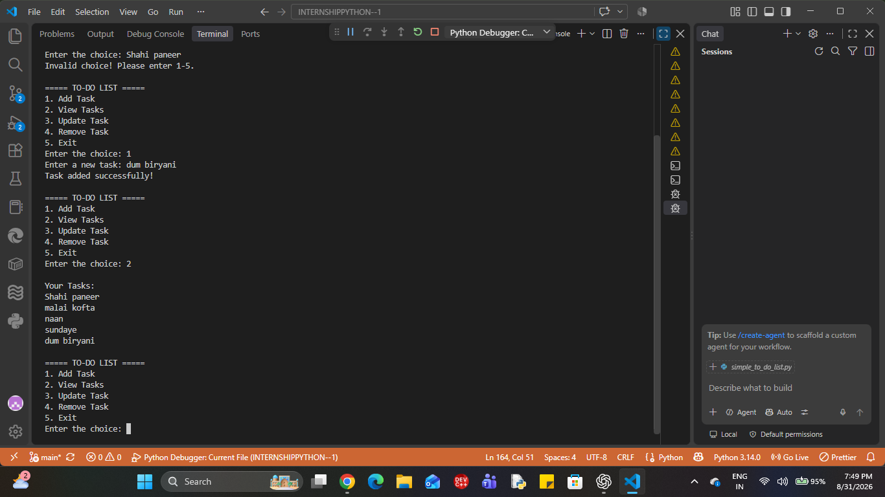
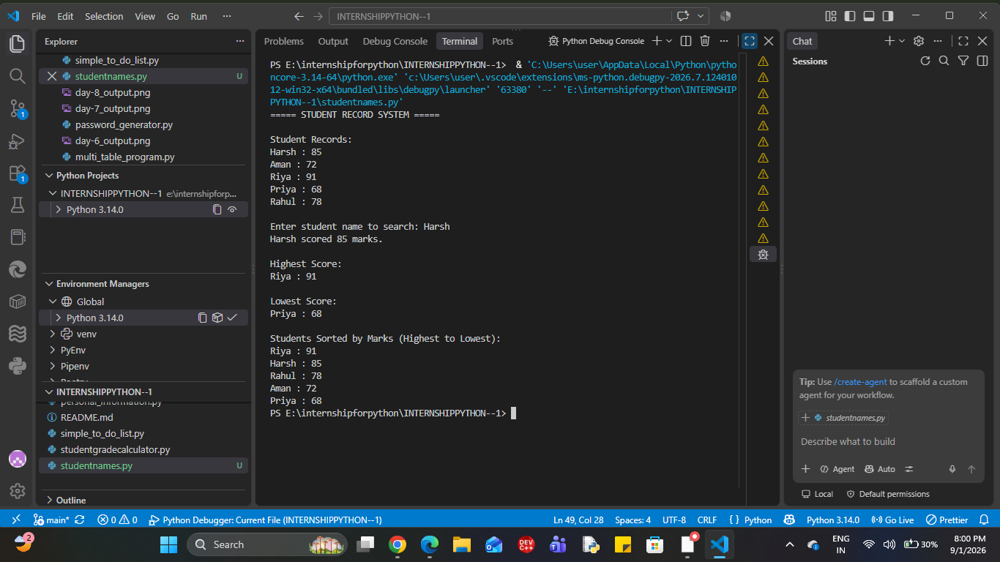

# INTERNSHIPPYTHON--1
this is a clean repository for mainly  python programme . This is a best source for internship and today is the day one
This project is a simple Python program taht accepts a user's basic personal information and displays it as a clean, formatted profile. 
This proiject was created as part of Level 1 - Day 1 of the Python PRogramming internship.

Objective
: python variable 
: f-strings
: data type
: type conversion

Technologies used; 
python
vs code
inputs : 
the inputs whuch we have given in program are
> name 
> age
> cgpa
> college
> city
> course
> grade

 numeric values are converted to appropriate data types using type casting.

 output:
 The program displays the entered information in a clean and formatted student profile.

 How to run 
 1) Make sure python is installed on your system.
 2) open the the project folder in vs code.
 3) open the terminal
 4) run the following command: 
    git add -personal_information.py
    git commit "then add some message"
    then git push origin main

5) enter the requested information when prompted.

output 
now the program generate teh output.

SAMPLE OUTPUT:
--student details--
Name: Harsh Chauhan
course:Btech
cgpa:8.09
city:Agra
college:Hindustan College of SCience and Technology
age:19
grade:A

Project structure: 
INTERNSHIPPYTHON-1
||
  | - persoanl_information.py
  | - README.md


  INTERVIEW QUESTIONS 
  1) WHAT IS A VARIABLE TO PYTHON?
  Basically it is an address of the memory given by the user.
  eg : age = 19
  hence , age is teh variable

  2) DIFFERENCE BETWEEN THE INPUT() AND prinT()?
  input() it is used to input the information from the user. 
  print() it is used to display the output to the user. 

  3) what is an f-strings?
  An f-string is a convienient way to put variables or expressions directly inside a string. 
  name = "Harsh"
  print(f"name: {name}")

  4)what is type conversion required for user input?
  Because input() returns the entered value as a string.
  for eg: 
  age = input("Enter teh age: ")
  in this example, 
  we see that the age give input in string data type.

  age = int(input("Enter teh age: "))
  in this example, 
  we see that the age is print in int data type.


  #day - 2 
  simple calculator program
  --project overview:
  This project is a simple Python calculator that accepts two numbers from the user and performs basic arithmetic operations.

  OBJECTIVE:

  to practice 
  ___ user input handling
  __ arithmetic operators
  __ Functions
  __ Basic program logic

  Features:

  ___ addition
  ___ subtraction
 ____ multiplication
 ___ division
 ___ floor(//)

 Technologies used:
 ___ VS code
 ___ Python

 How to run
 1) open the vs code 
 2) make a calculator file 
 3) tehn run the program 
 4) by git add, init, commit and then push 
 5) make your local repo to the github.

 Sample output:

 Enter teh first number: 12
Enter the second number: 2

----SIMPLE CALCULATOR----
addition:  14.0
subtraction: 10.0
multiplication:  24.0
Division:  6.0
floor_division: 6.0

INTERVIEW QUESTIONS 

1) - /performs regular division.
   - // performs floor division which give round off the value of whole division.
   - % performs modulo division which give remainder as an output.

2) The program checks for division or modulus by zero and displays an appropriate message instead of causing the program to crash.

----INTERNSHIP PROGRESS----
> day 1 - personal information program
> day 2 - simple calculator program

### 🧪 Day 2 Output


Day - 3 : BUILD AN EVEN OR ODD CHECKER

PROJECT OVERVIEW
this project is a simple python program to display the even number or odd number by given data through the user. 

Objective:
the objective of this project is to learn:
. conditional statements(if or else)
. THE modulo operator(%)
.integer input using input() and int()
. basic python program

Tehnologies used:
Python
Vs code

Program logic:
The program checks the remainder when the entered number is divided by 2:
. if number % 2 == 0 then even 
. else odd.

Python code:
a = int(input("Enter the number: "))
if a % 2 == 0:
    print("even")
    
else:
    print("odd")

    Test cases:
    input | output
    13        odd


 sample output:

 Enter the number: 13
 odd

 INTERVIEW QUESTIONS:

 1) HOW DO YOU CHECK WHETHER A NUMBER IS EVEN IN PYTHON?
 ANS - we check the number is even when number % 2 gives remainder is equal to zero.

 2)what is the purpose of % operator?
 ANS - It returns the remainder after division.

 3)What is the difference between if, elif, else?
 ANS - if checks a condition, elif checks another condition where previous condition is false. Else executes the final condition whereas all of the previous conditions is false.

 INTERNSHIP  PROGRESS
 > day 1 - personal information program
> day 2 - simple calculator program
> day 3 - even or odd checker program

### day 3 - output
## 📸 Sample Output


###DAY -4 INTERNSHIP 
# 🎓 Student Grade Calculator

## 📌 Project Overview

The Student Grade Calculator is a Python program that accepts a student's name and marks for multiple subjects.

It calculates:

- Total marks
- Percentage
- Final grade

The program also validates user input to prevent invalid marks.

---

## 🎯 Objective

This project was created as part of **Day 4 of the Veda Technology Python Programming Internship**.

The main objectives are to practice:

- Conditional statements
- Arithmetic operations
- Input validation
- `try-except` exception handling
- Loops
- User input
- Formatted output

---

## 🛠️ Technologies Used

- Python
- VS Code

---

## ⚙️ How the Program Works

1. The program asks for the student's name.
2. It asks for the number of subjects.
3. It accepts marks for each subject.
4. Marks are validated between `0` and `100`.
5. Invalid or non-numeric input is rejected.
6. The program calculates total marks.
7. The percentage is calculated.
8. A grade is assigned according to the predefined criteria.
9. The final student result is displayed.

---

## 📊 Grade Criteria

| Percentage | Grade |
|------------|-------|
| 90–100% | A++ |
| 80–89% | A |
| 70–79% | B+ |
| 60–69% | B |
| 50–59% | C+ |
| 40–49% | C |
| 30–39% | D |
| 20–29% | E |
| Below 20% | F |

---

## ✅ Input Validation

The program checks that:

- The number of subjects is greater than `0`.
- Marks are not negative.
- Marks do not exceed `100`.
- Numeric input is entered where required.

If invalid input is entered, the program displays an appropriate message and asks for valid input.

---

## 🧮 Calculation

### Total Marks

```text
Total Marks = Sum of marks obtained in all subjects

png
🎓 Interview Questions
1. How would you validate user input?

I would use conditional checks to verify that marks are within the allowed range. I can also use try-except to handle invalid data types.

2. How does Python evaluate multiple conditions?

Python evaluates conditions from top to bottom in an if-elif-else structure. Once a condition is true, its corresponding block is executed.

3. What happens if a user enters a value outside the expected range?

The program identifies the value as invalid and asks the user to enter a valid value within the allowed range.

🚀 Future Improvements
Add individual subject names.
Store student results in a file.
Add multiple student records.
Create a graphical user interface.
Generate a result report automatically.
👨‍💻 Internship

Veda Technology — Python Programming Internship

Day 4 Task: Student Grade Calculator

## 📸 Sample Output


# 🎯 Number Guessing Game

## 📌 Day 5 — Python Programming Internship

**Track:** Python Programming
**Level:** 1
**Task:** 5 — Number Guessing Game

---

## 📖 Project Description

The Number Guessing Game is a simple Python game in which the computer generates a random number between **1 and 100**.

The user repeatedly enters guesses until the correct number is found. After every guess, the program gives a hint:

* **Too high** — when the guess is greater than the secret number.
* **Too low** — when the guess is smaller than the secret number.
* **Correct** — when the guess matches the secret number.

The program also counts the number of valid attempts made by the user.

---

## 🎯 Objective

The main objective of this task is to practice:

* `while` loops
* `if`, `elif`, and `else` conditions
* Python's `random` module
* User input
* Type conversion
* Attempt counters
* Exception handling with `try/except`

---

## 🛠️ Technologies Used

* **Python**
* **random module**
* **VS Code**
* **GitHub**

---

## ⚙️ How the Program Works

1. The program imports the `random` module.
2. A random number between **1 and 100** is generated.
3. The attempt counter starts at `0`.
4. The user enters a guess.
5. The program validates the input.
6. The attempt counter increases for a valid guess.
7. The program compares the guess with the secret number.
8. It displays **Too high** or **Too low** as a hint.
9. The game continues until the correct number is guessed.
10. The program displays the total number of attempts.

---

## 🧠 Key Python Concepts

### Random Number Generation

```python
number = random.randint(1, 100)
```

This generates a random integer between 1 and 100.

### Attempt Counter

```python
attempts += 1
```

This increases the attempt count after every valid guess.

### Comparison

```python
if guess == number:
    print("Correct!")

elif guess > number:
    print("Too high.")

else:
    print("Too low.")
```

### Input Validation

```python
try:
    guess = int(input("Enter your guess: "))
except ValueError:
    print("Invalid input!")
```

This prevents the program from crashing when the user enters something that cannot be converted into an integer.

---

## 💻 Sample Gameplay

```text
Number guessing game
I have selected a number between 1 and 100.

Enter your guess: 67
Too high.

Enter your guess: 89
Too high.

Enter your guess: 23
Too low.

Enter your guess: 34
Too low.

Enter your guess: 60
Too high.

Enter your guess: 56
Too high.

Enter your guess: 50
Too low.

Enter your guess: 51
Too low.

Enter your guess: 52
Too low.

Enter your guess: 53
Too low.

Enter your guess: 54
Too low.

Enter your guess: 55
Correct! You guessed the number in 12 attempts.
```

---

## 📸 Output

The sample gameplay screenshot is included in:

**`day-5-output.png`**

---

## 🎤 Interview Questions

### 1. What is the `random` module?

The `random` module is a built-in Python module used to generate random values. For example, `random.randint(1, 100)` generates a random integer between 1 and 100.

### 2. What is the difference between `while` and `for` loops?

A `for` loop is generally used to iterate over a sequence or a specific range. A `while` loop continues executing as long as its condition is true and is useful when the number of iterations is not known in advance.

### 3. How would you limit the number of attempts?

I would use an attempt counter and a maximum-attempt value. The loop would stop when the counter reaches the maximum allowed attempts.

Example:

```python
attempts = 0
maximum_attempts = 5

while attempts < maximum_attempts:
    # take user guess
    attempts += 1
```

---

## 📂 Project Files

```text
INTERNSHIPPYTHON--1/
│
├── number_guessing_game.py
├── day-5-output.png
└── README.md
```

---

## ✅ Task Completion

**Day 5 — Completed ✔️**

The Number Guessing Game successfully demonstrates random number generation, loops, conditional statements, user interaction, input validation, and attempt counting.


# Day 6 – Multiplication Table Program

## 📌 Task

Build a Python program that takes a number from the user and displays its multiplication table from 1 to 10.

## 🧠 My Logic / Pseudocode

```python
# build a multiplication table
# use range (1, 11)
# for i = 0;
# i will change from 1 to 10
# multiply a * i
# then display the result
```

## 💻 Final Program

```python
# Multiplication Table

a = int(input("Enter the number: "))

for i in range(1, 11):
    print(a, "x", i, "=", a * i)
```

## 🔍 How It Works

1. The user enters a number.
2. The number is stored in variable `a`.
3. `range(1, 11)` generates numbers from **1 to 10**.
4. The `for` loop assigns each number to `i`.
5. `a * i` calculates each multiplication result.
6. `print()` displays the multiplication table.

## 🧪 Actual Output

I entered **12** as the input.

```text
Enter the number: 12

12 x 1 = 12
12 x 2 = 24
12 x 3 = 36
12 x 4 = 48
12 x 5 = 60
12 x 6 = 72
12 x 7 = 84
12 x 8 = 96
12 x 9 = 108
12 x 10 = 120
```

## 🎤 Interview Questions & Answers

### 1. When would you use a `for` loop?

**Answer:**
For loop determines the finite iteration. It is used when we need to perform a task for a fixed or finite number of iterations.

### 2. What does `range()` return?

**Answer:**
`range()` generates a sequence of numbers. For example, `range(1, 10)` gives:

```text
1, 2, 3, 4, 5, 6, 7, 8, 9
```

The ending number is not included.

### 3. What is the difference between `range(5)` and `range(1, 5)`?

**Answer:**

```text
range(5)    → 0, 1, 2, 3, 4
range(1, 5) → 1, 2, 3, 4
```

`range(5)` starts from **0**, while `range(1, 5)` starts from **1**. The ending value is excluded in both cases.

## 📚 Concepts Learned

* `for` loop
* `range()`
* Variables
* `input()`
* `int()`
* Multiplication operator `*`
* `print()`

## 🎯 Key Learning

The main concept learned today was using a **`for` loop with `range()`** to repeat an operation a fixed number of times.

The program follows a simple flow:

**Input → Loop → Multiply → Display**

## ✅ Day 6 Status

**Completed Successfully 🚀**


##DAY - 7 : Create a Password Generator
# 🔐 Day 7 — Simple Password Validator

## 📌 Internship

**Company:** Veda Technology
**Track:** Python Programming Internship
**Day:** 7 of 45
**Date:** August 30, 2026

---

## 🎯 Project Title

**Simple Password Validator**

---

## 📝 Description

The objective of this project is to build a Python program that checks whether a password satisfies basic security requirements.

The program validates the password based on:

* Minimum length
* Uppercase character
* Lowercase character
* Number/digit
* Special character

This project helps practice **strings, conditions, loops, string methods, and basic input validation**.

---

## 🛠️ Tools & Technologies

* Python
* `string` module
* VS Code

---

## 📋 Validation Rules

A password is considered valid when it satisfies all of the following requirements:

1. Minimum **8 characters**
2. At least **one uppercase character**
3. At least **one lowercase character**
4. At least **one digit**
5. At least **one special character**

---

## 🧠 Logic Used

1. Take the password as input.
2. Create Boolean variables for the validation requirements.
3. Use a `for` loop to examine each character.
4. Use `isupper()` to check for uppercase characters.
5. Use `islower()` to check for lowercase characters.
6. Use `isdigit()` to check for digits.
7. Use `string.punctuation` to check for special characters.
8. Use `len()` to check the minimum length.
9. Check all requirements using conditional statements.
10. Display whether the password is valid or incomplete.

---

## 💻 Python Code

```python
import string

password = input("Enter your password: ")

uppercase = False
lowercase = False
digit = False
special = False

for character in password:
    if character.isupper():
        uppercase = True

    if character.islower():
        lowercase = True

    if character.isdigit():
        digit = True

    if character in string.punctuation:
        special = True

if len(password) >= 8 and uppercase and lowercase and digit and special:
    print("Password is valid")
else:
    print("Password is incomplete")

    if len(password) < 8:
        print("Password must contain at least 8 characters")

    if not uppercase:
        print("Password must contain an uppercase character")

    if not lowercase:
        print("Password must contain a lowercase character")

    if not digit:
        print("Password must contain a number")

    if not special:
        print("Password must contain a special character")
```

---

## 🧪 Output & Testing

The program was tested with both a **valid** and an **invalid** password.

### ✅ Test Case 1 — Valid Password

**Input:**

```text
Hello!123
```

**Output:**

```text
Password is valid
```

### ❌ Test Case 2 — Invalid Password

**Input:**

```text
hello123
```

**Output:**

```text
Password is incomplete
Password must contain an uppercase character
Password must contain a special character
```

### 📸 Output Screenshot

Both test cases were executed successfully and captured in one output screenshot:

**`day-7 password_output.png`**

---

## 🎤 Interview Questions & Answers

### 1. How can you check whether a string contains a digit?

**Answer:**
We can use the `isdigit()` string method to check whether a character or string contains only digits.

Example:

```python
character.isdigit()
```

---

### 2. What are string methods?

**Answer:**
String methods are built-in Python methods used to perform operations or checks on strings, such as checking uppercase, lowercase, digits, alphabets, and other characters.

Examples:

```python
isupper()
islower()
isdigit()
isalpha()
isalnum()
```

---

### 3. Why should passwords not be stored or displayed as plain text?

**Answer:**
Passwords should not be stored or displayed as plain text because unauthorized users could gain access to them and misuse them. Passwords should be securely protected, typically using hashing.

---

## 📚 Concepts Practiced

* Python strings
* `input()`
* `for` loop
* `if` conditions
* Boolean variables
* `len()`
* String methods
* `isupper()`
* `islower()`
* `isdigit()`
* `string.punctuation`
* Basic input validation

---

## 💡 Key Learning

Through this project, I learned how to validate user input using Python string methods, loops, Boolean variables, and conditional statements.

I also learned the importance of protecting passwords instead of storing or displaying them as plain text.

---

## 📂 Project Files

```text
INTERNSHIPPYTHON--1/
│
├── password_generator.py
├── day-7 password_output.png
└── README.md
```

---

## ✅ Day 7 Status

**Completed Successfully 🎉**

**Veda Technology Python Programming Internship — Day 7/45**
day - 7 screenshot


# Day 8 – Simple To-Do List

**Veda Technology – Python Programming Internship**

## 📌 Project Overview

For Day 8 of my Python internship at **Veda Technology**, I built a simple **command-line To-Do List application** using Python.

The application allows the user to:

* Add tasks
* View tasks
* Update tasks
* Remove tasks
* Exit the application
* Handle invalid menu choices

This project helped me understand how **lists, loops, conditions, functions/operations, and menu-driven programs** can be combined to create a practical application.

---

## 🎯 Objective

The main objective of this project was to learn and practice:

* Python Lists
* `input()`
* `append()`
* `remove()`
* `index()`
* `for` loops
* `while` loops
* `if`, `elif`, and `else`
* Menu-driven programming
* CRUD operations
* Basic input validation

---

## 🛠️ Tools Used

* **Python**
* **VS Code / Python IDE**
* **Command Line / Terminal**
* **Git & GitHub**

---

## 🧠 My Approach / Logic

I developed the program step by step.

### Step 1 – Create a List

I started by creating a list to store tasks:

```python
tasks = ["Shahi paneer", "malai kofta", "naan", "sundaye"]
```

### Step 2 – Add a Task

I used `input()` to take a new task and `append()` to add it to the list.

```python
new_task = input("Enter a new task: ")
tasks.append(new_task)
```

### Step 3 – View Tasks

I used a `for` loop to display every task individually.

```python
for task in tasks:
    print(task)
```

### Step 4 – Remove a Task

I used `input()` and `remove()` to remove a selected task.

```python
remove_task = input("Enter the task to remove: ")
tasks.remove(remove_task)
```

### Step 5 – Update a Task

I first considered removing the old task and appending the new task. Then I improved the logic so that the updated task stays in its original position.

```python
update_task = input("Enter the task you want to update: ")
new_task = input("Enter the new task: ")

index = tasks.index(update_task)
tasks[index] = new_task
```

### Step 6 – Menu

I used `while True` to continuously display the menu until the user chooses Exit.

```python
while True:
    print("1. Add Task")
    print("2. View Tasks")
    print("3. Update Task")
    print("4. Remove Task")
    print("5. Exit")

    user = input("Enter the choice: ")
```

---

## 📝 Pseudocode

```text
START

Create an empty/list of tasks

REPEAT:
    Display menu

    Ask user for choice

    IF choice = 1:
        Ask for new task
        Add task to list

    ELSE IF choice = 2:
        Display all tasks

    ELSE IF choice = 3:
        Ask which task to update
        Ask for new task
        Find old task
        Replace old task with new task

    ELSE IF choice = 4:
        Ask which task to remove
        Remove task from list

    ELSE IF choice = 5:
        Exit the program

    ELSE:
        Display "Invalid choice"

UNTIL user chooses Exit

END
```

---

## 🔄 CRUD Operations

CRUD represents four basic operations used for managing data.

| CRUD  | Meaning | Implementation                    |
| ----- | ------- | --------------------------------- |
| **C** | Create  | Add a task using `append()`       |
| **R** | Read    | View tasks using a `for` loop     |
| **U** | Update  | Find and replace an existing task |
| **D** | Delete  | Remove a task using `remove()`    |

---

## 💻 Complete Program

```python
# ============================================
# Day 8 - Simple To-Do List
# Veda Technology - Python Programming Internship
# ============================================

# PSEUDOCODE / LOGIC:
# 1. Create a list to store tasks
# 2. Display a menu to the user
# 3. Ask the user to enter a choice
# 4. If choice is 1:
#       Take a new task
#       Add it to the list
# 5. If choice is 2:
#       Display all tasks using a loop
# 6. If choice is 3:
#       Ask which task to update
#       Ask for the new task
#       Replace the old task
# 7. If choice is 4:
#       Ask which task to remove
#       Remove it from the list
# 8. If choice is 5:
#       Exit the program
# 9. Otherwise:
#       Display "Invalid choice"
# 10. Repeat the menu until the user chooses Exit

tasks = ["Shahi paneer", "malai kofta", "naan", "sundaye"]

while True:

    print("\n===== TO-DO LIST =====")
    print("1. Add Task")
    print("2. View Tasks")
    print("3. Update Task")
    print("4. Remove Task")
    print("5. Exit")

    user = input("Enter the choice: ")

    # CREATE - ADD TASK
    if user == "1":

        new_task = input("Enter a new task: ")
        tasks.append(new_task)

        print("Task added successfully!")

    # READ - VIEW TASKS
    elif user == "2":

        print("\nYour Tasks:")

        for task in tasks:
            print(task)

    # UPDATE TASK
    elif user == "3":

        update_task = input("Enter the task you want to update: ")
        new_task = input("Enter the new task: ")

        if update_task in tasks:

            index = tasks.index(update_task)
            tasks[index] = new_task

            print("Task updated successfully!")

        else:
            print("Task not found!")

    # DELETE - REMOVE TASK
    elif user == "4":

        remove_task = input("Enter the task to remove: ")

        if remove_task in tasks:

            tasks.remove(remove_task)

            print("Task removed successfully!")

        else:
            print("Task not found!")

    # EXIT
    elif user == "5":

        print("Exiting To-Do List...")
        break

    # INVALID CHOICE
    else:

        print("Invalid choice! Please enter 1-5.")
```

---

## ▶️ Sample Execution

```text
===== TO-DO LIST =====
1. Add Task
2. View Tasks
3. Update Task
4. Remove Task
5. Exit

Enter the choice: 2

Your Tasks:
Shahi paneer
malai kofta
naan
sundaye
```

### Adding a Task

```text
Enter the choice: 1
Enter a new task: Kadai paneer
Task added successfully!
```

### Updating a Task

```text
Enter the choice: 3
Enter the task you want to update: naan
Enter the new task: Butter naan
Task updated successfully!
```

### Removing a Task

```text
Enter the choice: 4
Enter the task to remove: sundaye
Task removed successfully!
```

### Invalid Choice

```text
Enter the choice: 8
Invalid choice! Please enter 1-5.
```

### Exiting

```text
Enter the choice: 5
Exiting To-Do List...
```

---

# 🎤 Interview Questions & Answers

### 1. Why are lists useful?

**Answer:**
Lists are useful because they allow us to store multiple values in a single variable. They are ordered and can be modified, so we can easily add, remove, update, and access items.

### 2. What does CRUD mean?

**Answer:**
CRUD stands for **Create, Read, Update, and Delete**. These are the four basic operations used to manage data.

### 3. Why would you separate operations into functions?

**Answer:**
Separating operations into functions makes the program easier to understand, maintain, test, and reuse. Each function can handle one specific task.

---

## 📚 Key Python Concepts Learned

### `append()`

Adds an item to the end of a list.

```python
tasks.append(new_task)
```

### `remove()`

Removes a specific value from a list.

```python
tasks.remove(remove_task)
```

### `index()`

Finds the position of an item in a list.

```python
index = tasks.index(update_task)
```

### `while True`

Keeps the menu running continuously.

```python
while True:
```

### `break`

Stops the loop and exits the application.

```python
break
```

### `for` Loop

Used to go through each task in the list.

```python
for task in tasks:
    print(task)
```

---

## ✅ Project Outcome

I successfully created a **command-line To-Do List application** using Python.

Through this project, I practiced:

* Lists
* Loops
* Conditions
* User input
* CRUD operations
* Menu-driven programming
* Basic validation
* Program structure and logic

This project was a step forward from simple individual Python programs toward building a **small interactive application**.

---

## 👨‍💻 Internship Progress

**Internship:** Veda Technology
**Track:** Python Programming
**Day:** 8
**Project:** Simple To-Do List
**Status:** ✅ Completed
**Completed Successfully 🚀**


# 🐍 Day 9 – Practice Python Lists With Student Records

## 📌 Internship

**Veda Technology – Python Programming Internship**

## 📅 Day

**Day 9**

---

## 🎯 Objective

The objective of this task is to practice Python Lists by creating a student record program that can:

* Store student names and marks
* Display student records
* Search for a student
* Find the highest score
* Find the lowest score
* Sort students according to their marks

---

## 🛠️ Tools Used

* **Python**
* **VS Code**
* **Git & GitHub**

---

## 💡 Concepts Used

* Python Lists
* `for` loop
* `if-else`
* `in` operator
* `index()`
* `len()`
* `max()`
* `min()`
* `sorted()`
* `zip()`
* `lambda`
* User input

---

## 🧠 Program Logic / Pseudocode

```text
START

Create a list of student names
Create a list of marks corresponding to each student

Display all student records

Ask the user to enter a student name

IF the student exists:
    Find the student's index
    Display the marks using the same index
ELSE:
    Display "Student not found"

Find the highest mark
Find the student who achieved it
Display the highest score

Find the lowest mark
Find the student who achieved it
Display the lowest score

Sort the student records by marks
Display students from highest to lowest

END
```

---

## 💻 Program

```python
student_names = ["Harsh", "Aman", "Riya", "Priya", "Rahul"]
student_marks = [85, 72, 91, 68, 78]

print("===== STUDENT RECORD SYSTEM =====")

print("\nStudent Records:")

for i in range(len(student_names)):
    print(student_names[i], ":", student_marks[i])

search_name = input("\nEnter student name to search: ")

if search_name in student_names:
    index = student_names.index(search_name)
    print(search_name, "scored", student_marks[index], "marks.")
else:
    print("Student not found.")

highest_score = max(student_marks)
highest_index = student_marks.index(highest_score)

print("\nHighest Score:")
print(student_names[highest_index], ":", highest_score)

lowest_score = min(student_marks)
lowest_index = student_marks.index(lowest_score)

print("\nLowest Score:")
print(student_names[lowest_index], ":", lowest_score)

sorted_records = sorted(
    zip(student_names, student_marks),
    key=lambda student: student[1],
    reverse=True
)

print("\nStudents Sorted by Marks (Highest to Lowest):")

for name, marks in sorted_records:
    print(name, ":", marks)
```

---

## 🧪 Sample Output

```text
===== STUDENT RECORD SYSTEM =====

Student Records:
Harsh : 85
Aman : 72
Riya : 91
Priya : 68
Rahul : 78

Enter student name to search: Riya
Riya scored 91 marks.

Highest Score:
Riya : 91

Lowest Score:
Priya : 68

Students Sorted by Marks (Highest to Lowest):
Riya : 91
Harsh : 85
Rahul : 78
Aman : 72
Priya : 68
```

---

## 🎤 Interview Questions & Answers

### 1. What is a Python list?

A Python list is an ordered and mutable collection that can store multiple values in a single variable.

Example:

```python
students = ["Harsh", "Aman", "Riya"]
```

Lists support indexing, slicing, adding, removing, and modifying elements.

---

### 2. What is the difference between `sort()` and `sorted()`?

`sort()` modifies the original list, while `sorted()` creates and returns a new sorted list.

Example:

```python
numbers = [5, 2, 8, 1]

numbers.sort()
```

Here, the original list is changed.

With `sorted()`:

```python
numbers = [5, 2, 8, 1]

new_numbers = sorted(numbers)
```

The original list remains unchanged.

---

### 3. When would a dictionary be better than a list?

A dictionary is better when we need to store information using **key-value pairs** and access data using a meaningful key.

Example:

```python
student = {
    "name": "Harsh",
    "marks": 85
}
```

For larger student records containing names, marks, IDs, grades, and other information, dictionaries can make the data easier to organize and access.

---

## 📚 What I Learned

Through this task, I learned how to:

* Work with Python lists
* Keep related data synchronized using indexes
* Search elements inside a list
* Find maximum and minimum values
* Sort records
* Use `zip()` to combine related lists
* Understand when a dictionary can be a better data structure

---

## 📸 Output

The program was successfully executed and tested.

**Output Screenshot:** `day-9-output.png`

---

## 🚀 Conclusion

Day 9 helped me move beyond basic Python programs and practice real-world list processing. I learned how student records can be stored, searched, analyzed, and sorted using Python lists and built-in functions.

This task improved my understanding of **data handling and problem-solving using Python**.

---

**#Python #PythonProgramming #VedaTechnology #Internship #LearningPython #Programming #GitHub**
(day-9 output)


# 🚀 Day 10 – Python Lists: Student Records & Logic Building

**Internship:** Veda Technology
**Track:** Python Programming
**Day:** 10
**Topic:** Python Lists and Logic Building

---

## 📌 Project Overview

In Day 10 of my Python internship at **Veda Technology**, I focused on strengthening my **logic-building skills using Python Lists**.

Instead of only using built-in functions, I practiced solving problems using:

* Lists
* Indexing
* `for` loops
* `if` conditions
* Comparison operators
* Variables and counters
* Boolean flags
* `break`
* `.append()`
* `.remove()`

The main practice problem was based on **student names and Chemistry marks**.

---

## 🎯 Objective

The objective of this task was to understand how lists can be used to:

1. Store student records.
2. Connect related data using indexes.
3. Search for a particular student.
4. Find the highest and lowest marks.
5. Count students according to a condition.
6. Filter students based on marks.
7. Add and remove list elements.
8. Improve programming logic through loops and conditions.

---

## 🛠️ Technologies Used

* **Python**
* **VS Code**
* **Git & GitHub**

---

## 📂 Data Used

```python
students = ["Harsh", "Mohini", "Kratika", "Chirag", "Deepender"]

subject_chemistry = [76, 89, 90, 89, 96]
```

The indexes of both lists represent the same student.

| Index | Student   | Chemistry |
| ----: | --------- | --------: |
|     0 | Harsh     |        76 |
|     1 | Mohini    |        89 |
|     2 | Kratika   |        90 |
|     3 | Chirag    |        89 |
|     4 | Deepender |        96 |

### 💡 Important Logic

For example:

```python
students[4]
```

gives:

```text
Deepender
```

and:

```python
subject_chemistry[4]
```

gives:

```text
96
```

Therefore, the same index connects the student's name with their marks.

---

# 🧠 Logic Building Process

## 1. Display Lists

First, I created and displayed the student and marks lists.

```python
print(students)
print(subject_chemistry)
```

---

## 2. Finding the Highest Marks

### Logic

```text
Start with the first mark as the highest
        ↓
Check every mark
        ↓
If current mark > highest
        ↓
Update highest
```

I also stored the student name using the same index.

```python
highest = subject_chemistry[0]
highest_student = students[0]

for i in range(len(students)):
    if subject_chemistry[i] > highest:
        highest = subject_chemistry[i]
        highest_student = students[i]
```

**Result:**

```text
Highest Marks: 96
Highest Scoring Student: Deepender
```

---

## 3. Finding the Lowest Marks

### Logic

I started with the first mark as the lowest and compared every other mark.

```python
lowest = subject_chemistry[0]

for mark in subject_chemistry:
    if mark < lowest:
        lowest = mark
```

**Result:**

```text
Lowest Marks: 76
```

---

## 4. Counting Students Scoring More Than 90

### Logic

```text
Start count = 0
        ↓
Check every mark
        ↓
If mark > 90
        ↓
Increase count by 1
```

```python
count = 0

for mark in subject_chemistry:
    if mark > 90:
        count = count + 1
```

**Result:**

```text
Students scoring more than 90: 1
```

---

## 5. Displaying Students Scoring More Than 90

I used the index to connect the student's name with the corresponding mark.

```python
for i in range(len(students)):
    if subject_chemistry[i] > 90:
        print(students[i], "-", subject_chemistry[i])
```

**Output:**

```text
Deepender - 96
```

---

# 🔎 6. Searching for a Student

I built a search system using a **Boolean flag**.

### Logic

```text
Start found = False
        ↓
Check every student
        ↓
Name matches?
   ↓             ↓
 YES             NO
  ↓               ↓
found = True    Continue
  ↓
break
        ↓
After loop
        ↓
found == False?
        ↓
Student not found
```

```python
student = input("Enter student name: ")

found = False

for i in range(len(students)):
    if student == students[i]:
        found = True
        print("Student is found")
        print("Chemistry Marks:", subject_chemistry[i])
        break

if found == False:
    print("Student not found")
```

### 💡 What I Learned

The `found` variable remembers whether the student was successfully located.

The `break` statement stops the loop once the student is found.

---

# ➕ 7. Using `append()`

I learned that `.append()` is used to add a new element to the end of a list.

```python
students.append("Vikas")
```

---

# ➖ 8. Using `remove()`

I learned that `.remove()` removes a specified value from a list.

```python
students.remove("Vikas")
```

---

# 🧩 Key Python Concepts Practiced

| Concept          | Purpose                     |
| ---------------- | --------------------------- |
| List             | Store multiple values       |
| Index            | Access a particular element |
| `for` loop       | Process elements repeatedly |
| `if`             | Make decisions              |
| `max()`          | Find maximum value          |
| `.index()`       | Find position of a value    |
| `len()`          | Find list length            |
| `count` variable | Count matching values       |
| Boolean flag     | Remember search result      |
| `break`          | Stop a loop                 |
| `.append()`      | Add an element              |
| `.remove()`      | Remove an element           |

---

# 💻 Final Output

Example results from the program:

```text
Students: ['Harsh', 'Mohini', 'Kratika', 'Chirag', 'Deepender']
Chemistry Marks: [76, 89, 90, 89, 96]

Highest Marks: 96
Highest Scoring Student: Deepender

Lowest Marks: 76

Students scoring more than 90: 1

Students scoring more than 90:
Deepender - 96

Enter student name: Kratika
Student is found
Chemistry Marks: 90
```

---

# 🎓 Interview Questions & Answers

### Q1. What is a list in Python?

**Answer:**
A list is an ordered and mutable collection used to store multiple values in a single variable.

---

### Q2. What is indexing in Python?

**Answer:**
Indexing is used to access individual elements of a list. Python uses zero-based indexing, so the first element has index `0`.

---

### Q3. Why did you use the same index for two lists?

**Answer:**
I used the same index because the two lists contain related information. The student at `students[i]` corresponds to the marks at `subject_chemistry[i]`.

---

### Q4. What does `len()` do?

**Answer:**
`len()` returns the number of elements in a list.

Example:

```python
len(students)
```

returns `5`.

---

### Q5. What is the purpose of a `for` loop?

**Answer:**
A `for` loop allows me to process each element of a list one by one.

---

### Q6. What is the purpose of `break`?

**Answer:**
`break` immediately stops the loop. I used it after finding the required student so that the program does not continue unnecessary searching.

---

### Q7. Why did you use `found = False`?

**Answer:**
I used a Boolean flag to remember whether the student was found during the loop. It starts as `False` and becomes `True` when a matching student is found.

---

### Q8. What is the difference between `>` and `>=`?

**Answer:**

* `>` means greater than.
* `>=` means greater than or equal to.

For example:

```python
mark > 90
```

means marks must be strictly greater than 90.

---

### Q9. What does `.append()` do?

**Answer:**
`.append()` adds a new element to the end of a list.

---

### Q10. What does `.remove()` do?

**Answer:**
`.remove()` removes a specified value from a list.

---

# 💭 My Learning Reflection

Today I focused more on **logic building rather than simply memorizing Python commands**.

I learned how to break a problem into smaller steps:

```text
Problem
   ↓
Understand the data
   ↓
Create lists
   ↓
Use indexes
   ↓
Apply loops
   ↓
Add conditions
   ↓
Store results
   ↓
Display output
```

The most important concept I practiced today was **connecting two lists using the same index**.

I also learned that programming is not only about knowing commands; it is about developing the logic to solve a problem step by step.

---

# 🚀 Day 10 Outcome

By completing this task, I strengthened my understanding of:

**Python Lists → Indexing → Loops → Conditions → Searching → Counting → Flags → List Methods**

This practice prepared me for working with more structured data and larger Python programs in the upcoming internship tasks.

---

## 👨‍💻 Internship Progress

**Veda Technology – Python Programming Internship**

**Day 10 Completed ✅**

> Learning consistently, building logic step by step, and improving through practice. 🚀
